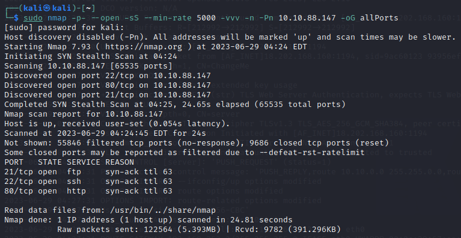
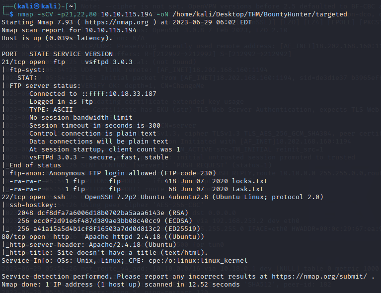
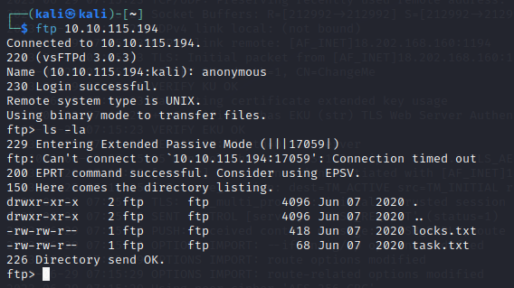
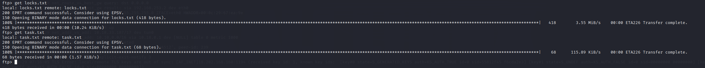
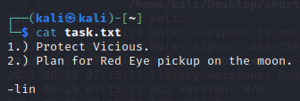
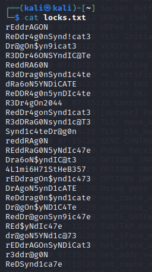
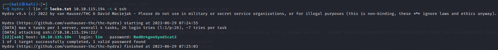
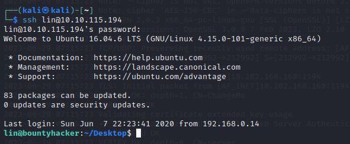
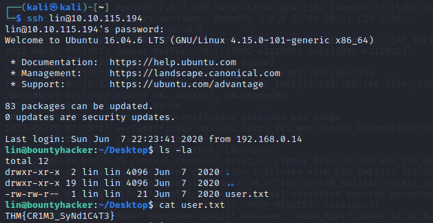
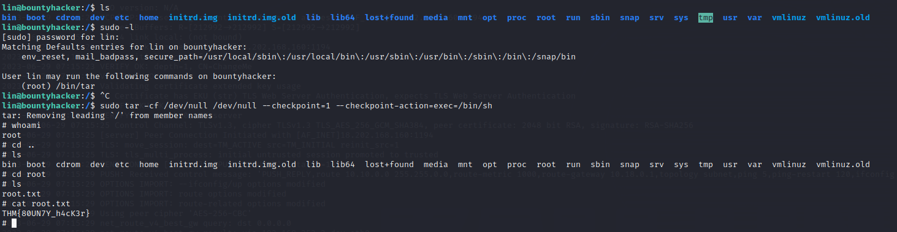

# Bounty Hunter

## DESCRIPCIÓN

Bounty Hunter es una ruta de aprendizaje y una serie de desafíos disponibles en la plataforma TryHackMe. Está diseñada para enseñar y desarrollar habilidades en el ámbito de la caza de recompensas en seguridad informática, también conocido como bug bounty hunting.

El curso de Bounty Hunter en TryHackMe está diseñado para ayudar a los participantes a comprender y practicar diversas técnicas utilizadas por los cazadores de recompensas de seguridad informática en el mundo real. El objetivo principal es aprender a encontrar y explotar vulnerabilidades en aplicaciones web, sistemas operativos, redes y otros elementos de infraestructura.

A lo largo de la ruta de aprendizaje de Bounty Hunter, los participantes tienen la oportunidad de enfrentarse a diferentes desafíos y escenarios de seguridad. Estos desafíos están diseñados para simular situaciones reales y proporcionar un entorno de laboratorio seguro donde los participantes pueden practicar sus habilidades de seguridad.

Algunos de los temas cubiertos en la ruta de Bounty Hunter incluyen:

1. Enumeración y escaneo de puertos.
2. Análisis de vulnerabilidades en aplicaciones web.
3. Explotación de vulnerabilidades comunes, como inyección de SQL, XSS (Cross-Site Scripting), LFI (Local File Inclusion), etc.
4. Escalada de privilegios en sistemas operativos.
5. Explotación de vulnerabilidades en servicios de red.
6. Uso de herramientas y técnicas para la recolección de información y la obtención de acceso no autorizado.

***

## ENUMERACION

### ESCANEO DE PUERTOS

Primero para verificar la conectividad con nuestra máquina objetivo, es útil lanzar un comando de **ping** se utiliza para enviar un único paquete:


```
ping -c1 {ip_address}
```


Ahora, procedemos a realizar un escaneo de puertos utilizando el comando **nmap**.


```
sudo nmap -p- -open -sS --min-rate 5000 -vvv -n -Pn {ip_address} -oG allPorts
```


Al ejecutar este comando con privilegios de administrador en Kali Linux y especificar la dirección IP de la máquina objetivo, realizará un escaneo completo de todos los puertos abiertos en el destino especificado:

<figure><figcaption><p>Escaneo completo de todos los puertos abiertos en el destino</p></figcaption></figure>

En el ejemplo que se muestra, se han identificado tres puertos abiertos:

* **Puerto 22/TCP SSH**: El puerto 22 es el puerto estándar utilizado para el protocolo SSH (Secure Shell), que permite el acceso remoto seguro a la máquina a través de una conexión cifrada. La presencia de este puerto abierto sugiere que es posible conectarse de forma remota a la máquina utilizando SSH.
* **Puerto 80/TCP HTTP**: El puerto 80 es el puerto estándar utilizado para el protocolo HTTP (Hypertext Transfer Protocol), que se utiliza para la comunicación en la web. La presencia de este puerto abierto indica que el servicio web HTTP está activo en la máquina objetivo.
* **Puerto 21/TCP FTP**: El puerto 21 es el puerto estándar utilizad para el protocolo FTP (File Transfer Protocol), que permite la transferencia de archivos entre sistemas.

Usamos el siguiente comando de nmap para obtener mas información sobre cada uno de los puertos abiertos y lo guardaremos en la ruta especificada:


```
sudo nmap -sCV -p21,22,80 {ip_address} -oN /home/kali/Desktop/THM/BountyHunter/targeted
```


<figure><figcaption><p>Obtenemos mas información sobre cada uno de los puertos abiertos y lo guardaremos en la ruta especificada</p></figcaption></figure>

La información obtenida en el archivo de salida del escaneo proporciona detalles sobre los servicios y puertos encontrados en la máquina objetivo.&#x20;

A continuación, se explica la información relevante obtenida en el archivo:

**FTP**

Sobre el servicio FTP en el puerto 21/TCP podemos destacar lo siguiente:

* El puerto 21/TCP está abierto, lo que indica que el servicio FTP está en funcionamiento en la máquina objetivo.
* El software utilizado para el servidor FTP es VSFTPD versión 3.0.3.

Además, se proporciona información sobre el acceso anónimo en el servidor FTP:

* El acceso FTP anónimo está permitido, lo que significa que se puede acceder al servidor FTP sin autenticación utilizando las credenciales de "ftp" o simplemente dejando el campo de usuario en blanco.
* Se muestran dos archivos en el servidor FTP:
  * "locks.txt" con un tamaño de 418 bytes, creado el 7 de junio de 2020.
  * "task.txt" con un tamaño de 68 bytes, también creado el 7 de junio de 2020.

Esta información revela la presencia de un servidor FTP en la máquina objetivo, que permite el acceso anónimo y tiene dos archivos disponibles para su descarga.

**SSH**

Sobre el servicio SSH en el puerto 22/TCP podemos destacar lo siguiente:

* El puerto 22/TCP está abierto, lo que indica que el servicio SSH está en funcionamiento en la máquina objetivo.
* El software utilizado para el servicio SSH es OpenSSH versión 7.2p2 en una distribución Ubuntu 4ubuntu2.8.
* Se proporciona información sobre las claves de host utilizadas por el servicio SSH:
  * Clave RSA de 2048 bits: dcf8dfa7a6006d18b0702ba5aaa6143e
  * Clave ECDSA de 256 bits: ecc0f2d91e6f487d389ae3bb08c40cc9
  * Clave ED25519 de 256 bits: a41a15a5d4b1cf8f16503a7dd0d813c2

Estas claves de host se utilizan para la autenticación del servidor SSH y permiten establecer una conexión segura entre el cliente y el servidor mediante el protocolo SSH.

**HTTP**

Sobre el servicio HTTP en el puerto 80/TCP podemos destacar lo siguiente:

* El puerto 80/TCP está abierto, lo que indica que el servicio HTTP (servidor web) está en funcionamiento en la máquina objetivo.
* El software utilizado para el servidor web es Apache HTTPD versión 2.4.18 en una distribución Ubuntu.
* Se proporciona información adicional sobre el servidor web:
  * El encabezado de respuesta del servidor (http-server-header) indica que el servidor es Apache/2.4.18 (Ubuntu).
  * El título de la página web (http-title) no se encuentra disponible y se indica como "Site doesn't have a title" (El sitio no tiene un título) en formato de texto/html.

Esto sugiere que la máquina objetivo está ejecutando un servidor web Apache versión 2.4.18 en un entorno Ubuntu. El hecho de que el título de la página web no esté disponible puede indicar que la página principal del sitio web no tiene un título específico configurado.

**CONCLUSIÓN**

En términos de vulnerabilidad relativa, el protocolo FTP tiende a ser considerado como el más vulnerable debido a su naturaleza heredada y las posibles vulnerabilidades asociadas.

Por otro lado, SSH y HTTP presentan un nivel de seguridad más sólido, aunque su vulnerabilidad depende en gran medida de la configuración y las prácticas de seguridad implementadas en los servidores y aplicaciones web correspondientes.&#x20;

Así que usaremos el protocolo FTP para acceder a la máquina objetivo y obtener mas información sobre ella.&#x20;

### **PUERTO 21/TCP FTP**

Accedemos al servidor FTP utilizando el comando `ftp {ip_address}` y observamos que podemos acceder usando el usuario por defecto **anonymous.** Una vez estemos dentro realizamos el comando `ls -la` para ver los ficheros que podemos obtener de la maquina objetivo.

<figure><figcaption><p>Acceso a la maquina por FTP usando el usuario anonymous</p></figcaption></figure>

Observamos que hay dos ficheros disponibles, así que vamos a descargarlos utilizando el comando `get {fichero}` y lo guardamos en nuestro equipo para despues comprobar que informacion contienen.

<figure><figcaption><p>Descarga de los ficheros del servidor FTP</p></figcaption></figure>

Para ver la información dentro de los ficheros vamos a utilizar el comando `cat {fichero}`, en este caso lo haremos con el fichero `task.txt` donde encontramos la primera bandera.

<figure><figcaption><p>Contenido del fichero task.txt</p></figcaption></figure>

A continuación, vamos a leer el contenido del fichero `locks.txt`.

<figure><figcaption><p>Contenido del fichero locks.txt</p></figcaption></figure>

Observamos que el contenido del fichero **locks.txt** se trata de una serie de contraseñas las cuales pueden pertenecer al usuario **lin** encontrado en el fichero **task.txt**

Así que utilizamos el siguiente comando de Hydra para realizar un ataque de fuerza bruta contra un servicio SSH en una máquina objetivo:

```
hydra -l lin -P locks.txt 10.10.115.194 -t 4 ssh 
```

<figure><figcaption><p>Ataque de fuerza bruta contra un servicio SSH</p></figcaption></figure>

Al ejecutar este comando, Hydra intentará iniciar sesión en el servicio SSH de la máquina objetivo utilizando el nombre de usuario **lin** y las contraseñas del archivo **locks.txt**. Realizará un ataque de fuerza bruta probando diferentes combinaciones de nombres de usuario y contraseñas hasta encontrar una coincidencia exitosa.

Usamos el siguiente comando para acceder a la maquina objetivo utilizando el usuario **lin** y la contraseña que obtuvimos previamente.

```
ssh lin@10.10.115.194
```

<figure><figcaption><p>Acceso a la maquina objetivo mediante el protocolo SSH</p></figcaption></figure>

Una vez dentro utilizamos el comando `ls -la` para comprobar los ficheros que hay dentro de la maquina.

Observamos que hay un fichero `user.txt` el cual nos interesa

<figure><figcaption><p>Contenido del fichero user.txt </p></figcaption></figure>

Ahora tendremos que realizar el siguiente comando para encontrar el fichero root.txt donde encontraremos la respuesta a la ultima prueba

```
sudo tar -cf /dev/null /dev/null --checkpoint=1 --checkpoint-action=exec=/bin/sh
```

Debemos dirigirnos al directorio raíz para encontrar el fichero que necesitamos. Una vez estemos ubicados realizamos el comando `ls` para ver los ficheros que se encuentran dentro

<figure><figcaption><p>Contenido del fichero root.txt</p></figcaption></figure>
