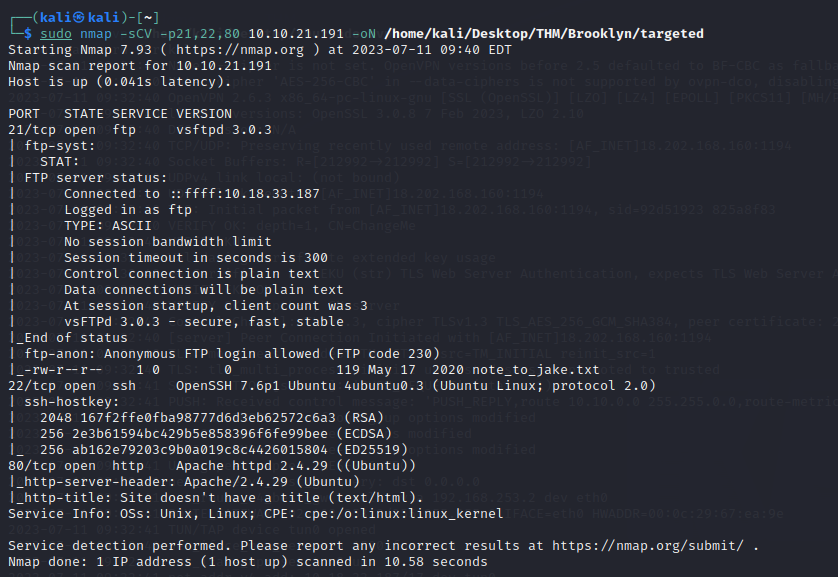
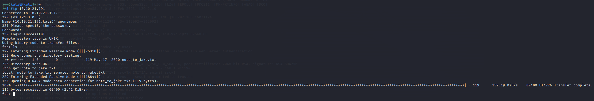
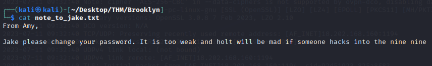
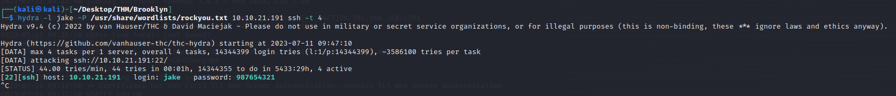
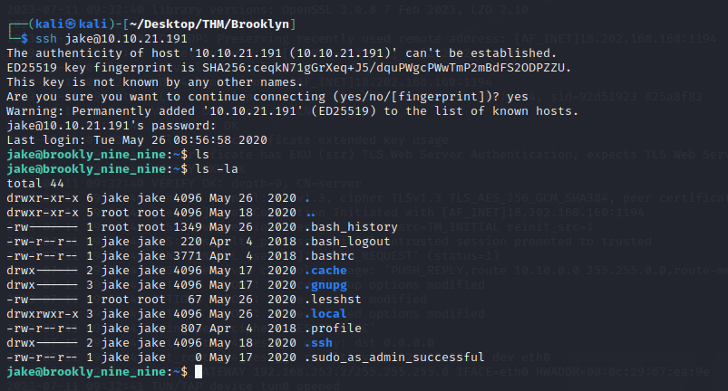
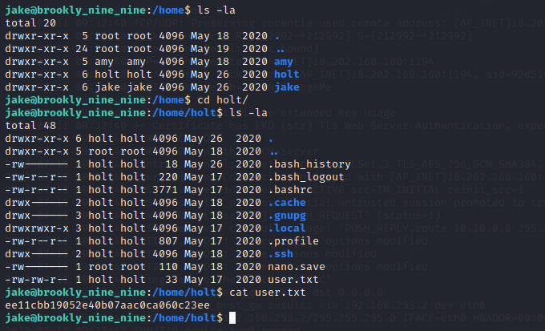
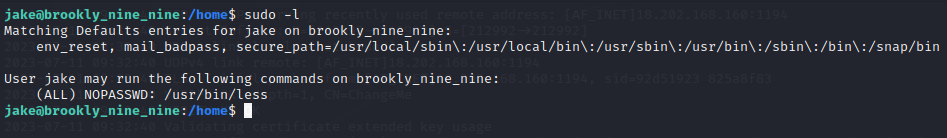
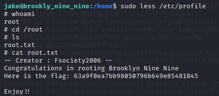

# Brooklyn Nine Nine

## ENUMERACIÓN

### ESCANEO DE PUERTOS

En primer lugar, al llevar a cabo una evaluación de la conectividad con nuestra máquina objetivo, resulta beneficioso ejecutar un comando de ping que envía un único paquete. El propósito de este comando es comprobar si hay una respuesta exitosa desde la dirección IP específica que deseamos verificar.


```
ping -c1 {ip_address}
```


Una vez que hayamos completado esta verificación inicial de conectividad, podemos proceder a realizar un escaneo de puertos utilizando la herramienta de línea de comandos llamada **nmap**.&#x20;

En el entorno de Kali Linux, un sistema operativo popular para pruebas de penetración y evaluaciones de seguridad, podemos ejecutar el siguiente comando con privilegios de administrador y especificar la dirección IP de la máquina objetivo.


```
nmap -sCV -p21,22,80 10.10.21.191 -oN /home/kali/Desktop/THM/Brooklyn/targeted
```


<figure><figcaption></figcaption></figure>

En el ejemplo que se muestra, se han identificado tres puertos abiertos:

* **Puerto 22/TCP SSH**: El puerto 22 es el puerto estándar utilizado para el protocolo SSH (Secure Shell), que permite el acceso remoto seguro a la máquina a través de una conexión cifrada. La presencia de este puerto abierto sugiere que es posible conectarse de forma remota a la máquina utilizando SSH.
* **Puerto 80/TCP HTTP**: El puerto 80 es el puerto estándar utilizado para el protocolo HTTP (Hypertext Transfer Protocol), que se utiliza para la comunicación en la web. La presencia de este puerto abierto indica que el servicio web HTTP está activo en la máquina objetivo.
* **Puerto 21/TCP FTP**: El puerto 21 es el puerto estándar utilizad para el protocolo FTP (File Transfer Protocol), que permite la transferencia de archivos entre sistemas.

Aquí, obtenemos resultados interesantes para **ftp** , muestra que podemos iniciar sesión en ftp como anónimos. También podemos ver que tiene un archivo de texto llamado " **note\_to\_jake.txt** ".

### PUERTO 21/TCP FTP

Accedemos al servidor FTP utilizando el comando `ftp {ip_address}` y observamos que podemos acceder usando el usuario **anonymous** y la contraseña en blanco.&#x20;

Una vez estemos dentro realizamos el comando `ls -la` para ver los ficheros que podemos obtener de la maquina objetivo. Observamos que hay un fichero disponible, así que vamos a descargarlo utilizando el comando `get {fichero}` y lo guardamos en nuestro equipo para después comprobar que información contiene.

<figure><figcaption></figcaption></figure>

Una vez descargado el fichero en nuestro equipo vamos a utilizar el comando cat para comprobar la información que nos puede ofrecer.

<figure><figcaption></figcaption></figure>

Utilizando el comando `cat` leemos las siguientes líneas dentro del fichero:

> _From Amy,_
>
> _Jake please change your password. It is too weak and holt will be mad if someone hacks into the nine nine_

Lo que traducido nos muestra la siguiente información:

> _De Amy,_
>
> _Jake por favor cambia tu contraseña. Es demasiado débil y Holt se enojará si alguien piratea el nueve nueve._

Teniendo en cuenta esta información podemos pensar que **Jake** es un usuario del sistema, por lo que vamos a aprovechar esta información para realizar un ataque de fuerza bruta al puerto 22/TCP SSH usando Hydra.


```
hydra -l jake -P /usr/share/wordlists/rockyou.txt <ip-máquina> ssh -t 4
```


<figure><figcaption></figcaption></figure>

Así podemos comprobar que efectivamente **Jake** tenia una contraseña débil y ahora podremos acceder mediante **SSH** a nuestra maquina objetivo.

### PUERTO 22/TCP SSH

Usamos el siguiente comando para acceder a la maquina objetivo utilizando el usuario **jake** y la contraseña que obtuvimos previamente. Una vez dentro utilizamos el comando `ls -la` para comprobar los ficheros que hay dentro de la maquina.

<figure><figcaption></figcaption></figure>

Vamos a navegar por el sistema para buscar nuestras banderas, para ello usaremos el comando `cd` hasta llegar al directorio deseado.&#x20;

Nos dirigimos al directorio `/home` donde observamos que hay 3 directorios con los nombres de las 3 personas mencionadas en el fichero **txt** mostrado anteriormente.&#x20;

Vamos a acceder al directorio de **Holt** que era la persona que indicaba **Amy** que iba a enfadarse por la contraseña débil de **Jake**, seguro tiene algo de nuestro interés.

<figure><figcaption></figcaption></figure>

Bien, hemos encontrado dentro nuestra primera bandera.

## ESCALAR PRIVILEGIOS

Vamos a intentar escalar privilegios para ello empezamos viendo si tenemos autoridad para ejecutar cualquier comando de root


```
sudo -l
```


<figure><figcaption></figcaption></figure>

Podemos ver que podemos ejecutar **less** comando como root. ¡Lindo! Podemos aprovechar esto para obtener un shell raíz usando este comando:


```
sudo less /etc/profile
!/bin/sh 
```


<figure><figcaption></figcaption></figure>

