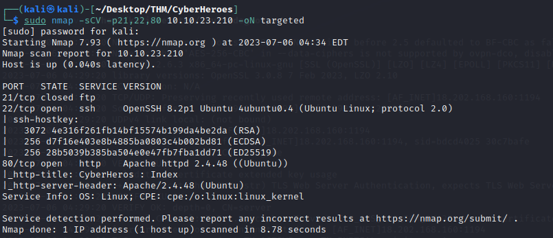
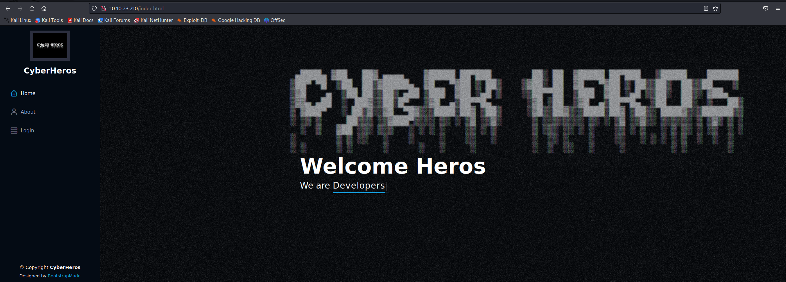
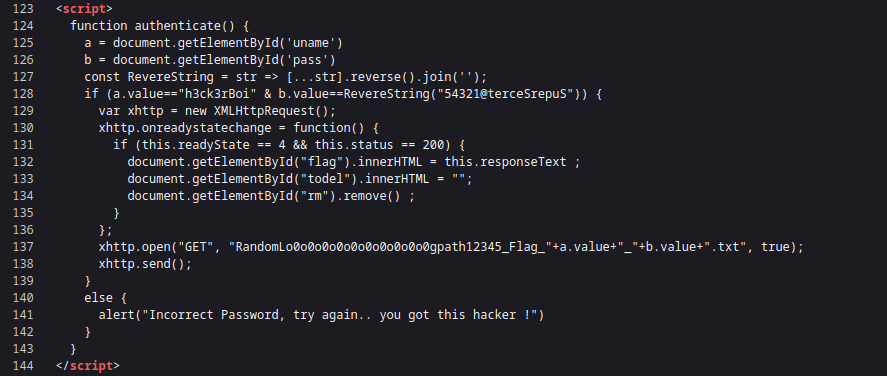

# CyberHeroes

## ENUMERACION

### ESCANEO DE PUERTOS

En primer lugar, para verificar la conectividad con nuestra máquina objetivo, es útil ejecutar un comando de **ping** que envía un único paquete.


```
ping -c1 {ip_address}
```


Una vez completada esta verificación, procedemos a realizar un escaneo de puertos utilizando el comando **nmap**. Para ello, en Kali Linux, ejecutamos el siguiente comando con privilegios de administrador y especificamos la dirección IP de la máquina objetivo:

<figure><figcaption></figcaption></figure>

En el ejemplo que se muestra, se han identificado dos puertos abiertos:

* **Puerto 22/TCP SSH**: El puerto 22 es utilizado por el protocolo SSH (Secure Shell) para proporcionar acceso seguro a través de una red. SSH se utiliza comúnmente para administrar sistemas remotos de forma segura y permite la autenticación y el cifrado de la comunicación.
* **Puerto 80/TCP HTTP**: El puerto 80 es comúnmente utilizado para el tráfico HTTP (Hypertext Transfer Protocol). En este caso, se menciona que Apache está ejecutándose en este puerto.

No podremos hacer mucho con SSH sin conocer las credenciales así que echemos un vistazo al sitio web a ver que información obtenemos.

### PUERTO 80/TCP HTTP

Accedemos al sitio web de la dirección IP mediante nuestro navegador. A simple vista no obtenemos gran información así que vamos a inspeccionar el código fuete de la pagina e investigar que nos puede ser útil.

<figure><figcaption></figcaption></figure>

Al examinar el código fuente de nuestro de las paginas y observamos unas líneas en el código del login que nos puede servir.

<figure><figcaption></figcaption></figure>

Como observamos nos encontramos con un script de autenticación donde muestra una variable a para el usuario y una variable b para la contraseña. Después realiza una comprobación del valor donde nos da el usuario y la contraseña encriptada.

```
<script>
    function authenticate() {
      a = document.getElementById('uname')
      b = document.getElementById('pass')
      const RevereString = str => [...str].reverse().join('');
      if (a.value=="h3ck3rBoi" & b.value==RevereString("54321@terceSrepuS")) { 
        var xhttp = new XMLHttpRequest();
        xhttp.onreadystatechange = function() {
          if (this.readyState == 4 && this.status == 200) {
            document.getElementById("flag").innerHTML = this.responseText ;
            document.getElementById("todel").innerHTML = "";
            document.getElementById("rm").remove() ;
          }
        };
        xhttp.open("GET", "RandomLo0o0o0o0o0o0o0o0o0o0gpath12345_Flag_"+a.value+"_"+b.value+".txt", true);
        xhttp.send();
      }
      else {
        alert("Incorrect Password, try again.. you got this hacker !")
      }
    }
</script>
```

Para conseguir desencriptar la contraseña tan solo tendremos que ir al terminal y escribir el siguiente comando:

```
echo "54321@terceSrepuS" | rev
```

Ahora solo tendremos que realizar el login y nos entregara nuestra bandera para la prueba.
