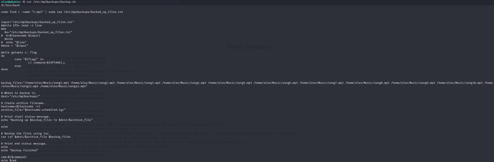

# Cyborg

En primer lugar, al llevar a cabo una evaluación de la conectividad con nuestra máquina objetivo, resulta beneficioso ejecutar un comando de ping que envía un único paquete. El propósito de este comando es comprobar si hay una respuesta exitosa desde la dirección IP específica que deseamos verificar.


```
ping -c1 {ip_address}
```


Una vez que hayamos completado esta verificación inicial de conectividad, podemos proceder a realizar un escaneo de puertos utilizando la herramienta de línea de comandos llamada **nmap**.&#x20;

En el entorno de Kali Linux, un sistema operativo popular para pruebas de penetración y evaluaciones de seguridad, podemos ejecutar el siguiente comando con privilegios de administrador y especificar la dirección IP de la máquina objetivo.

<figure><figcaption></figcaption></figure>

Esto responde a las dos 3 primeras preguntas sobre la cantidad de puertos y qué servicios se ejecutan en los puertos.

Además, es posible que deseemos asociar la dirección IP de la máquina objetivo con un nombre más legible para facilitar su reconocimiento. Podemos lograr esto agregando la dirección IP y el nombre deseado al archivo de hosts en nuestra propia máquina.

```
 echo "<ip_address> cyborg.thm" | sudo tee -a /etc/hosts
```

Accedemos a la pagina web observamos&#x20;

<figure><figcaption></figcaption></figure>

Una vez que hayamos añadido la dirección IP al archivo de hosts, podemos realizar un análisis de directorios utilizando la herramienta gobuster en la URL correspondiente. El análisis de directorios nos permite descubrir posibles directorios y archivos ocultos en el servidor web de la máquina objetivo.

<figure><figcaption></figcaption></figure>

Durante el escaneo, se encontraron algunos directorios que parecen ser interesantes:

* /admin muestra un sitio web relacionado con un músico.&#x20;
* /etc/ contiene una lista de directorios, entre ellos, destaca la carpeta `/etc/squid/`, que a su vez contiene un archivo llamado **passwd** además de un archivo **squid.conf** el cual parece contener líneas de configuración de proxy.

Accedemos a la web `/admin` y nos encontramos una página web que aparenta ser estática, es decir, que su contenido no se actualiza con frecuencia. En esta página, llamó nuestra atención una mención del nombre **Alex** en la descripción de Setup, podría ser un posible nombre de usuario.

<figure><figcaption></figcaption></figure>

Durante nuestra navegación por la web, nos encontramos con un descubrimiento intrigante: lo que parece ser un chat entre dos personas en una página en particular.&#x20;

En este chat, se menciona Alex en el chat. Parece que Alex está hablando sobre algún tipo de proxy, lo cual podría sugerir que está utilizando una herramienta o configuración para acceder a recursos de forma indirecta o a través de una ruta alternativa. Esto podría tener implicaciones significativas en términos de seguridad y accesibilidad a ciertos recursos.

Alex hace referencia a un **backup** en `music_archive`. Esta mención de un respaldo en el directorio `music_archive` puede ser de gran importancia, ya que los **backups** a menudo contienen información valiosa y podrían ofrecernos una oportunidad para obtener acceso a datos adicionales o incluso descubrir vulnerabilidades en el sistema.

<figure><figcaption></figcaption></figure>

Además vemos la posibilidad de descargar un archivo comprimido en formato `tar` en el menú **Archive > Download**. Una vez que descargado el archivo `tar`, procedemos a descomprimir utilizando el comando `tar -xvf ruta/fichero.tar` y examinar su contenido.

<figure><figcaption></figcaption></figure>

Encontramos archivos que parecen haber sido creados con [**BorgBackup**](https://borgbackup.readthedocs.io/en/stable/#what-is-borgbackup), pero actualmente no disponemos de la frase necesaria para acceder a ellos. Esta frase se utiliza para proteger y cifrar los datos almacenados, lo que garantiza una capa adicional de seguridad y confidencialidad.

**BorgBackup**, es una herramienta popular para realizar copias de seguridad y compresión de datos.

<figure><figcaption></figcaption></figure>

Anteriormente, durante el escaneo con **Gobuster**, se descubrió un directorio denominado `/etc/`.&#x20;

Posteriormente, se llevó a cabo una búsqueda adicional en dicho directorio, lo que condujo al descubrimiento de un nuevo directorio llamado `squid`. Dentro de este directorio, se encontraron dos archivos: **passwd** y **squid.conf**.

<figure><figcaption></figcaption></figure>

Observamos en el archivo **passwd** una contraseña que está cifrada utilizando el algoritmo **MD5**. El hecho de que la contraseña esté cifrada en MD5 implica que se ha aplicado una función de hash criptográfico a la contraseña original para generar una cadena de caracteres alfanuméricos de longitud fija.

El cifrado **MD5** es ampliamente conocido y utilizado, pero es importante destacar que se considera obsoleto en términos de seguridad.


```
music_archive:$apr1$BpZ.Q.1m$F0qqPwHSOG50URuOVQTTn.
```


Al examinar el archivo **squid.conf**, podemos identificar unas líneas de configuración relacionadas con el proxy.&#x20;


```
auth_param basic program /usr/lib64/squid/basic_ncsa_auth /etc/squid/passwd
auth_param basic children 5
auth_param basic realm Squid Basic Authentication
auth_param basic credentialsttl 2 hours
acl auth_users proxy_auth REQUIRED
http_access allow auth_users
```


La contraseña que hemos encontrado parece estar cifrada utilizando el algoritmo **MD5**. Para intentar descifrarla y obtener la contraseña en texto plano, existen dos herramientas que podemos utilizar:&#x20;

* **John the Ripper** (también conocido como "**john**") es una popular herramienta de cracking de contraseñas que puede realizar ataques de fuerza bruta y diccionario.
* **Hashcat** es otra herramienta especializada en el cracking de contraseñas y es conocida por su capacidad para aprovechar la potencia de cálculo de las tarjetas gráficas (GPU).

En ambas opciones podemos proporcionarle el archivo con el hash MD5 y configurar diferentes modos de ataque para intentar descifrar la contraseña. Para crear el archivos simplemente usaremos el comando `nano hash` e introduciremos la contraseña cifrada obtenida en **passwd**.



```
john hash --wordlist=/usr/share/wordlists/rockyou.txt
```

<figure><figcaption></figcaption></figure>



```
hashcat -a 0 -m 1600 hash /usr/share/wordlists/rockyou.tx
```

<figure><figcaption></figcaption></figure>



Listo ya tenemos nuestra frase necesaria para acceder, el siguiente paso consiste en configurar la frase necesaria para **borg** mediante el uso del siguiente comando.


```
export BORG_PASSPHRASE='[... REDACTED ...]' 
```


Para obtener una lista de los archivos en el repositorio, utilizamos el comando `borg list ruta/repositorio`, al utilizar este comando nos encontramos `music_archive`.


```
borg list home/field/dev/final_archive  
```


<figure><figcaption></figcaption></figure>

Ahora procederemos utilizando el comando `borg extract` vamos a extraer el contenido de `music_archive` que encontramos dentro del directorio `home/field/dev/final_archive`.


```
borg extract home/field/dev/final_archive/::music_archive
```


Una vez ejecutado este comando, observamos que se crea un nuevo directorio llamado `alex`.

<figure><figcaption></figcaption></figure>

Al acceder a la carpeta de `alex`, nos encontramos con la presencia de dos archivos de texto que podrían contener información relevante, como nombres de usuario o contraseñas, que podrían ser útiles para avanzar.

<figure><figcaption></figcaption></figure>

Analizando los archivos, comprobamos que en ellos se encontramos las credenciales que estábamos buscando.

Con esta información en nuestro poder, podremos utilizar las credenciales encontradas para autenticarnos en la máquina objetivo mediante SSH, así obtener un mayor acceso y control sobre ella.

Para acceder a la máquina, utilizamos el protocolo SSH con el nombre de usuario **alex** y la contraseña que hemos encontrado previamente.

<figure><figcaption></figcaption></figure>

Ejecutamos el comando `ls` para listar el contenido del sistema de archivos, así ver qué archivos y directorios se encuentran en la ubicación actual. Al revisar la lista, identificamos la presencia de un archivo llamado **user.txt**.&#x20;

Este archivo contiene nuestra primera bandera.

## ESCALADA DE PRIVILEGIOS

Decidimos realizar el comando `sudo -l` para verificar los permisos del usuario **alex**. Este comando nos permite obtener información sobre los privilegios de _superusuario_ que se le han otorgado a dicho usuario.

<figure><figcaption></figcaption></figure>

Observamos que se nos permite ejecutar el script **backup.sh** sin necesidad de proporcionar una contraseña. Esto significa que podemos ejecutar el script de respaldo sin restricciones adicionales de autenticación. Veamos si se puede abusar del script.

<figure><figcaption></figcaption></figure>

Una observación interesante que se destaca de inmediato son las dos últimas líneas. En estas líneas se ejecuta lo que se encuentre en la variable `$command` y se guarda la salida en la variable `$cmd`. La salida se imprime una vez que la ejecución ha finalizado.

Es importante destacar que el contenido de la variable `$command` proviene de un argumento de línea de comando llamado `-c`. Esto significa que es posible ejecutar cualquier comando como usuario root utilizando esta funcionalidad. En otras palabras, tenemos la capacidad de ejecutar comandos privilegiados en el sistema.

Si bien podríamos ejecutar el comando `bash` directamente, es relevante mencionar que toda la salida generada por la ejecución del comando se recopila en la variable `$cmd`.&#x20;

Dado esto, es posible ir directamente al archivo **root.txt**, que probablemente contenga información o privilegios asociados al usuario root. Por lo tanto, podemos acceder a información confidencial o realizar acciones privilegiadas mediante la ejecución de comandos como usuario root.

Aprovechando el script anterior, podemos utilizar el comando de la siguiente manera `sudo /etc/mp3backups/backup.sh -c "cat /root/root.txt"`.&#x20;

<figure><figcaption></figcaption></figure>

Esta línea de comandos nos permite obtener nuestra última bandera o indicador.
