# Gotta Catch'em All!

## DESCRIPCION

El desafío **Gotta Catch'em All!** de **TryHackMe** es un emocionante juego de captura de banderas que tiene como objetivo evaluar tus habilidades en seguridad informática y resolución de problemas.&#x20;

Este desafío se basa en el apasionante mundo de Pokémon y te brinda la oportunidad de poner a prueba tus conocimientos en un entorno divertido y educativo. A lo largo del juego, enfrentarás una serie de desafíos diseñados para desafiar tu ingenio y habilidades técnicas, y deberás resolverlos para capturar las banderas y progresar en el juego.

Participar en este desafío es una excelente manera de mejorar tus habilidades en seguridad informática mientras te sumerges en el emocionante mundo de Pokémon.

## ENUMERACION

### ESCANEO DE PUERTOS

En primer lugar, para verificar la conectividad con nuestra máquina objetivo, es útil ejecutar un comando de **ping** que envía un único paquete:


```
ping -c1 {ip_address}
```


<figure><figcaption></figcaption></figure>

Una vez completada esta verificación, procedemos a realizar un escaneo de puertos utilizando el comando **nmap**. Para ello, en Kali Linux, ejecutamos el siguiente comando con privilegios de administrador y especificamos la dirección IP de la máquina objetivo:


```
sudo nmap -p- -open -sS --min-rate 5000 -vvv -n -Pn {ip_address} -oG allPorts
```


<figure>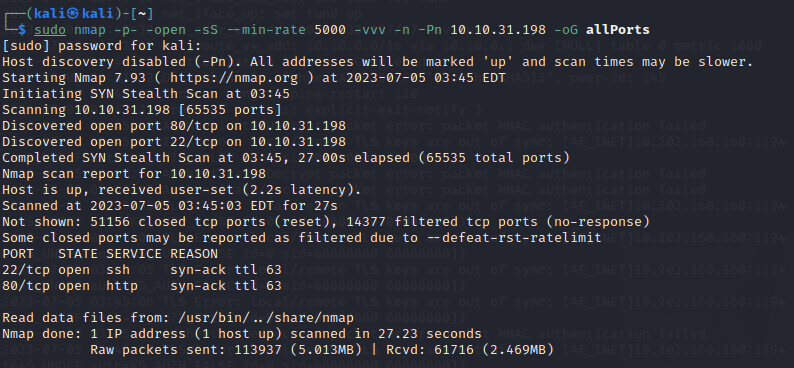<figcaption></figcaption></figure>

En el ejemplo que se muestra, se han identificado dos puertos abiertos:

* **Puerto 22/TCP SSH**: El puerto 22 es utilizado por el protocolo SSH (Secure Shell) para proporcionar acceso seguro a través de una red. SSH se utiliza comúnmente para administrar sistemas remotos de forma segura y permite la autenticación y el cifrado de la comunicación.
* **Puerto 80/TCP HTTP**: El puerto 80 es comúnmente utilizado para el tráfico HTTP (Hypertext Transfer Protocol). En este caso, se menciona que Apache está ejecutándose en este puerto.

No podremos hacer mucho con SSH sin conocer las credenciales asi que echemos un vistazo al sitio web a ver que información obtenemos.

### **PUERTO 80/TCP** HTTP

Accedemos al sitio web de la dirección IP mediante nuestro navegador y nos encontramos con una pagina de bienvenida predeterminada de Apache2. A simple vista no obtenemos gran información asi que vamos a inspeccionar el código fuete de la pagina e investigar que nos puede ser útil.

<figure>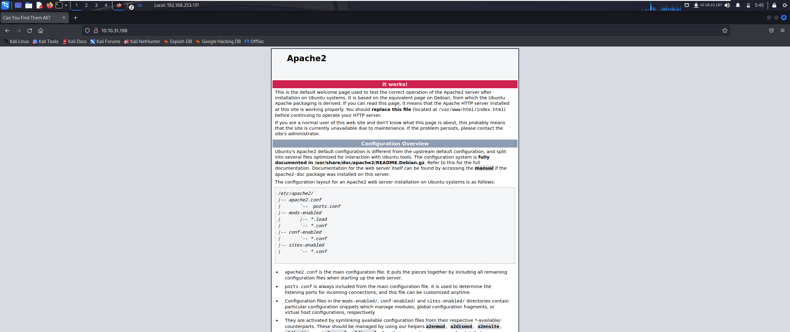<figcaption></figcaption></figure>

Al examinar el código fuente de nuestro sitio web, nos encontramos con un script que contiene un lista de nombres de Pokémon:


```
<script type="text/javascript">
   	const randomPokemon = [
   		'Bulbasaur', 'Charmander', 'Squirtle',
   		'Snorlax',
   		'Zapdos',
   		'Mew',
   		'Charizard',
   		'Grimer',
   		'Metapod',
   		'Magikarp'
   	];
   	const original = randomPokemon.sort((pokemonName) => {
   		const [aLast] = pokemonName.split(', ');
   	});
   	console.log(original);
</script>
```


Pero esta información no es relevante. Siguiendo el flujo del código en la parte inferior de la pagina web, encontramos con dos etiquetas las cuales no parecen corresponder con el **HTML**.&#x20;


```
<pokemon>:<hack_the_pokemon>
        <!--(Check console for extra surprise!)-->
```


Se tratan de las credenciales de acceso por SSH de nuestra maquina objetivo por lo que podemos dejar de investigar la web.

### PUERTO 22/TCP SSH

Ahora que tenemos las posibles credenciales necesarias para acceder a nuestra maquina objetivo mediante SSH vamos a comprobar si hay conexión:

```
ssh <user>@<ip_address>
```

<figure>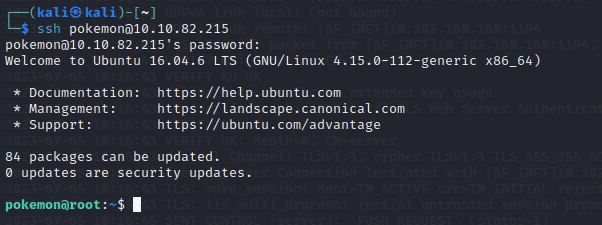<figcaption></figcaption></figure>

Una vez dentro, podemos comprobar los permisos de nuestro usuario y el grupo al que pertenece. Observamos que nuestro usuario forma parte de varios grupos pero no **sudo** con lo que no tendremos privilegios de administrador.

## FLAGS

### POKEMON TIPO HIERBA

Ahora que estamos dentro del equipo objetivo, vamos a listar los directorios con el comando `ls -lAh *` para mostrar una lista detallada de archivos y directorios en el directorio actual, incluyendo archivos ocultos.

<figure>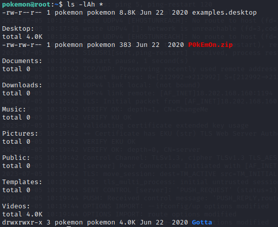<figcaption></figcaption></figure>

Tendremos que acceder al Escritorio y una vez dentro encontraremos el fichero P0kEmOn.zip donde encontraremos el fichero grass-type.txt en el se encuentra nuestra primera respuesta.

<figure>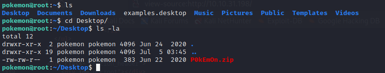<figcaption></figcaption></figure>

Vamos a descomprimir el zip utilizando el comando unzip para poder acceder al contenido de la carpeta.


```
unzip P0kEmOn.zip
```


<figure>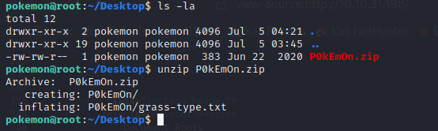<figcaption></figcaption></figure>

Ahora tan solo tendremos que leer el fichero `txt` para obtener nuestro Pokémon de tipo hierba. Pero al comprobar el contenido del fichero observamos que se trata de un código hexadecimal el cual tendremos que traducir para obtener la primera bandera.

Utilizaremos un descodificador hexadecimal como el que nos encontramos en [**cryptii**](https://cryptii.com/pipes/hex-decoder).

### POKEMON TIPO AGUA

Teniendo en cuenta el nombre del fichero anterior, buscaremos nuestro Pokémon de tipo agua, para ello ejecutamos el siguiente comando así obtendremos la ruta donde se encuentra nuestro fichero:

```
find / -name water-type.txt 2> /dev/null
```

<figure>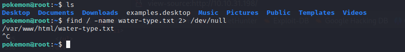<figcaption></figcaption></figure>

Observamos que encuentra un fichero navegaremos hasta el directorio y leeremos el contenido del fichero:

<figure>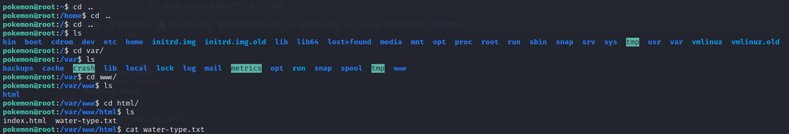<figcaption></figcaption></figure>

Observamos que el contenido se encuentra cifrado en Cesar así que usaremos [**Caesar Cipher**](https://cryptii.com/pipes/caesar-cipher) que nos encontramos en **Cryptii**.&#x20;

Así obtendremos nuestra segunda bandera.

### POKEMON TIPO FUEGO

Vamos a ejecutar el mismo comando pero esta vez buscaremos el fichero `water-type.txt` para obtener la ruta de nuestra siguiente bandera.

```
find / -name fire-type.txt 2> /dev/null
```

<figure>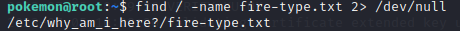<figcaption></figcaption></figure>

Este comando nos muestra que nuestro fichero se encuentra dentro de una carpeta llamada **`why_am_i_here?`** que a su vez esta dentro del directorio `/etc` así que navegaremos hasta ella y utilizaremos el comando `cat` para obtener el contenido del fichero `fire-type.txt` donde encontraremos nuestra tercera bandera.

<figure>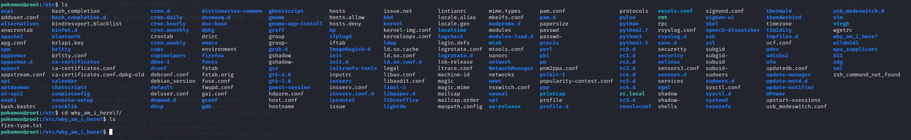<figcaption></figcaption></figure>

Esta vez la respuesta esta cifrada en **Base64**, así que vamos a descifrarlo utilizando [**Base64decode**](https://www.base64decode.org/).

### **POKEMON FAVORITO**

Nos queda por encontrar un ultimo Pokémon para encontrar todas nuestras banderas y superar la prueba.

Como vimos antes en la [**primera bandera**](gotta-catchem-all.md#pokemon-tipo-hierba), al ejecutar el comando `ls -lAh *` encontramos un directorio dentro de Videos llamado **Gotta** donde se podemos encontrar el fichero que buscamos. Esto hace referencia a la famosa frase "Hazte con todos" de Pokemon.&#x20;

Pero una vez dentro nos encontramos con un fichero extraño con nombre:

`Could_this_be_what_Im_looking_for?.cplusplus`

<figure>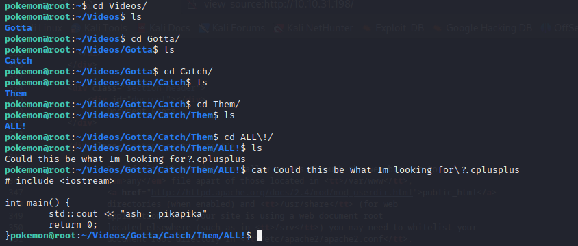<figcaption></figcaption></figure>

Realizamos `cat` del fichero y nos muestra un texto con las credenciales necesarias para acceder al usuario **ash** el cual tiene privilegios de **root** sobre el fichero `roots-pokemon.txt`.

Así que vamos a dirigirnos al directorio home donde encontramos los directorios raíz de cada usuario y el fichero `roots-pokemon.txt` que necesitamos para resolver la ultima respuesta.

<figure>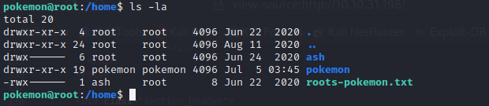<figcaption></figcaption></figure>

Bien para terminar, solo tendremos que realizar el comando `su ash` para cambiar al usuario ash y poder leer el fichero que contiene la ultima bandera.

<figure>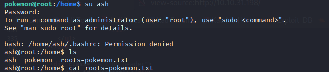<figcaption></figcaption></figure>

