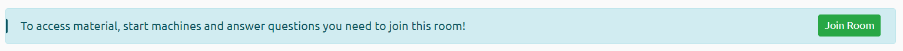
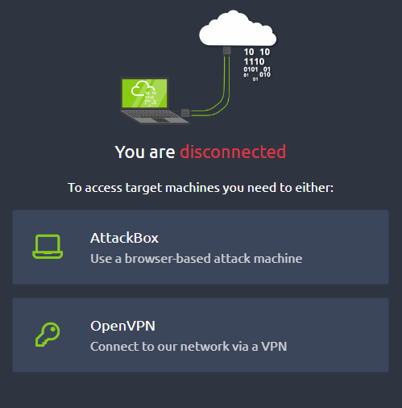
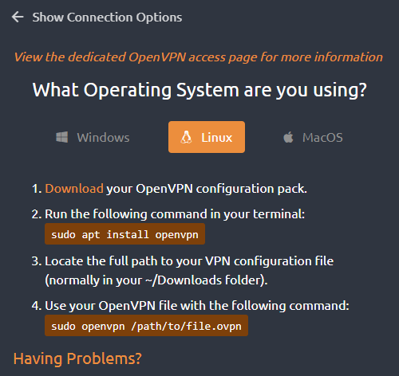
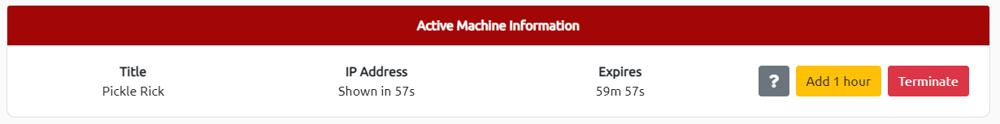

# Introducción

## CONECTAR VPN&#x20;

Para poder conectarnos con la maquina que deseemos primero necesitamos unirnos a una sala dentro de **TryHackMe**, para ello tendremos que hacer click en el botón **Join Room** el cual nos creara una sala propia.

<figure><figcaption></figcaption></figure>

 

<figure><figcaption></figcaption></figure>

Esto nos abrirá el siguiente panel lateral donde nos muestra que en este momento estamos desconectados. Tenemos dos opciones para conecctarnos a las maquinas:

* **AttackBox**, donde abriremos en el propio navegador una maquina configurada por **TryHackMe** para atacar.
* **OpenVPN**, la cual nos generara un fichero de configuración de una VPN como acceso a las maquinas objetivos de **TryHackMe.**

En nuestro caso usaremos **OpenVPN** ya que tenemos nuestra propia maquina Kali Linux preparada para realizar las pruebas.

<figure><figcaption></figcaption></figure>

Después de seleccionar nuestra opción de conexión nos muestra los pasos a seguir por cada sistema operativo sobre el que deseemos trabajar. Como bien sabemos, Kali esta basado en sistemas operativos Linux así que seleccionaremos la opción al sistema correspondiente.

<figure><figcaption></figcaption></figure>

Tras seleccionar Linux como sistema operativo, observamos los pasos que tendremos que realizar para configurar nuestra red VPN y poder acceder a las maquinas objetivo:

1. Descarga tu paquete de configuración de **OpenVPN**.&#x20;
2. Ejecuta el siguiente comando en tu terminal: `sudo apt install openvpn`&#x20;
3. Encuentra la ruta completa de tu archivo de configuración de VPN.&#x20;
4. Utiliza tu archivo de **OpenVPN** con el siguiente comando: `sudo openvpn /ruta/nombre_archivo.ovpn`

Por ultimo, dentro de la prueba que deseemos realizar bajaremos hasta la sección de las tareas, para a continuación hacer click en el botón <mark style="color:green;">**Start Machine**</mark> para obtener la IP de nuestra maquina objetivo y así empezar con la prueba.

<figure><figcaption></figcaption></figure>

Este proceso tardará un minuto, una vez terminado nos mostrará un panel con la siguiente información:

* **Title**, esto nos muestra el nombre de la prueba que estemos realizando.
* **IP Address**, nos enseñara la direccion ip de nuestra maquina objetivo.
* **Expires**, muestra una cuenta atrás predeterminada con 1 hora que es el tiempo que disponemos para resolver la maquina.
* **Add 1 Hour,** TryHackMe nos dará 1 hora como máximo para resolver nuestra maquina, pero con este botón podemos añadir una hora más en caso de necesitarlo.
* **Terminate**, en caso de no querer resolver la prueba podremos utilizar este botón y terminar la conexión de nuestra maquina objetivo.

<figure><figcaption></figcaption></figure>

Una vez realizados todos los pasos anteriores podremos establecer conexión con las maquinas objetivo de TryHackMe, para comprobar dicha conexión utilizaremos el comando `ping -c1 <ip_address>`
